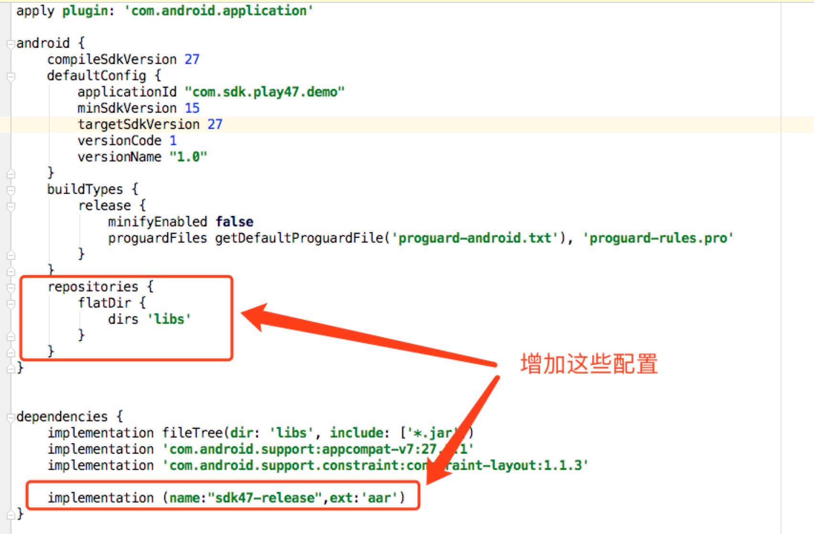

一、客户端接入

​	1、Android Studio

​	2、Eclipse或者手动


二、后端接入


### 一、Android接入

#### （1）Android Studio

- ##### 将sdk47-release.aar至拷贝至libs文件夹

- ##### 修改build.gradle文件

```java
    repositories {
        flatDir {
            dirs 'libs'
        }
    }
   
    implementation (name:"sdk47-release",ext:'aar')
```




#### （2）eclipse接入（手动接入）

- ##### 引入SDK文件lib47play.jar

- ##### 拷贝assets和res到对应的目录

- ##### 修改AndroidManifest.xml

```xml
	<uses-permission android:name="android.permission.INTERNET" />
	<uses-permission android:name="android.permission.REQUEST_INSTALL_PACKAGES" />
	
	<application
        android:allowBackup="true"
        android:label="@string/app_name"
        android:supportsRtl="true" >
        <activity
            android:name="com.sdk.play47.SdkActivity"
            android:configChanges="orientation|screenSize|keyboardHidden"
            android:theme="@android:style/Theme.Dialog"
            android:windowSoftInputMode="stateAlwaysHidden|adjustResize" />

        <!-- 7.0调用安装程序 -->
        <provider
            android:name="android.support.v4.content.FileProvider"
            android:authorities="${applicationId}.fileprovider"
            android:exported="false"
            android:grantUriPermissions="true" >
            <meta-data
                android:name="android.support.FILE_PROVIDER_PATHS"
                android:resource="@xml/play47_plugin" />
        </provider>
    </application>
```


#### （3）接口调用

##### 	1、初始化

	说明：初始化为赋值操作，无任何异步操作

```java
/
*	@params mAct 		游戏Activity 
*	@params appId		分配的参数
*	@params appKey 		分配的参数
*	@params orientation 横竖屏, 竖屏=1，横屏=2
*/
init(Activity mAct, String appId, String appKey, int orientation)
    
//调用示例
SdkManager.getInstance().init(this, "appId", "appKey",SdkManager.LANDSCAPE);
```

##### 	2、登录

```java
/
*	@params mAct		游戏Activity 
*	@params callback	处理登陆回调
*/
login(Activity mAct, AccountCallback callback)
    
//调用示例
private AccountCallback mLoginCallback = new AccountCallback() {
    @Override
    public void onLoginSuccess(String result) {
        //登录成功，result为登录成功返回结果
        //具体result结构下面有介绍
    }

    @Override
    public void onLoginFailed(String status, String message) {
        //status  失败的状态码
        //message 失败描述
        //一般游戏可不做任何处理，sdk已有提示
    }
};
SdkManager.getInstance().login(this, mLoginCallback);
```

	登录成功返回**result**数据结构

```json
{
    "user_id": "9",  //平台用户Id
    "token": "b82500734285a6b4c85816cbe2aa8d92"  //用户登录验证token，用于服务器校验
}
```

##### 	3、支付

```java
/
*	@params mAct			游戏Activity
*	@params product_id		商品Id
*	@params product_name	商品名称
*	@params amount			金额   1分钱="0.01"
*	@params cp_order_id		订单Id
*	@params cp_extra		透传参数
*/
pay(Activity mAct, String product_id, String product_name, String amount, String cp_order_id, String cp_extra)
    
//调用示例
SdkManager.getInstance().pay(this,"product_id", "60元宝","0.01","order_id_123455", "透传参数")
```

### 二、IOS接入

### 三、服务器接入

